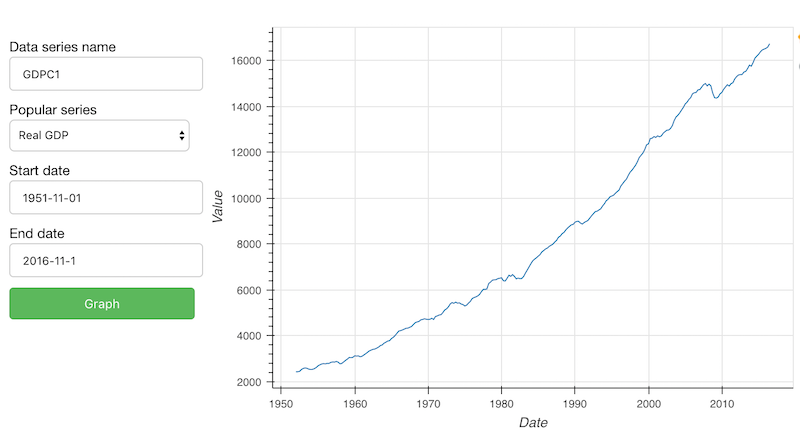

# Bokeh examples.

Here are a few reusable [Bokeh](http://bokeh.pydata.org/en/latest/) examples 
I made to facilitate the rapid deployment of Bokeh graphs and 
interactive websites in python.

Note: Bokeh is commonly used in two ways

1. Make graphs (to be inserted into static 
 html documents or Juypter notebooks).
2. Make interactive web sites from python without needing HTML or javascript (similar
 to [Shiny](https://shiny.rstudio.com/) in R).  
 
The folder *1_SimpleGraph* shows a minimal example of making a graph (only).  

The folder *2_InteractiveApp* shows two examples of interactive webapps made from Bokeh. 
* Folder *2_InteractiveApp/1_AppTemplate* holds a reusable template for an interactive website.
* In *2_InteractiveApp/2_GraphEconData*, I build a web app from the template 
  to view US economic data from the Federal Reserve.

These examples are based upon examples in the 
[Bokeh Gallery](http://bokeh.pydata.org/en/latest/docs/gallery.html).  See also
the [Bokeh Tutorial](http://nbviewer.jupyter.org/github/bokeh/bokeh-notebooks/blob/master/tutorial/00%20-%20intro.ipynb)
and [User Guide](http://bokeh.pydata.org/en/latest/docs/user_guide.html).

## Screenshot

